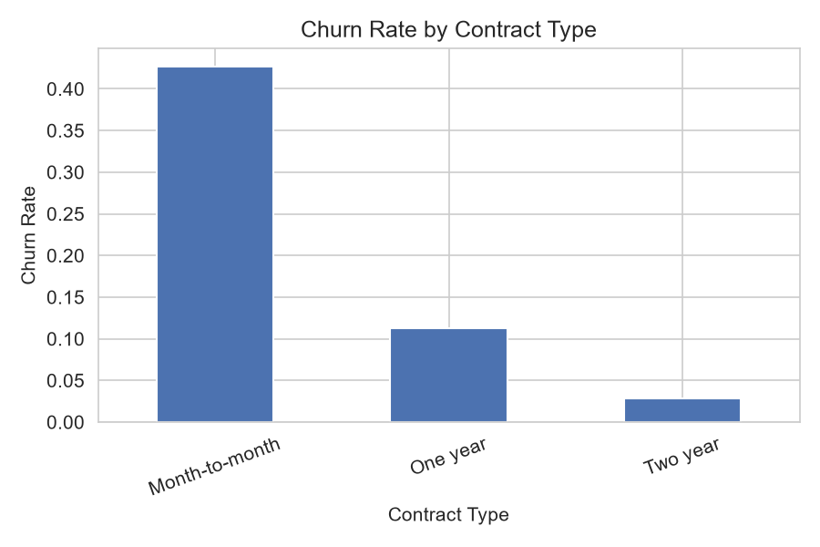
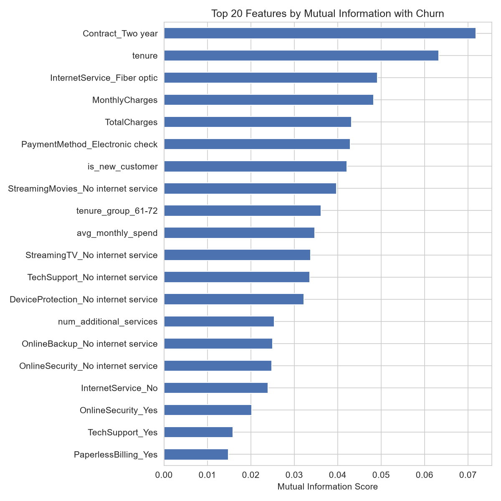
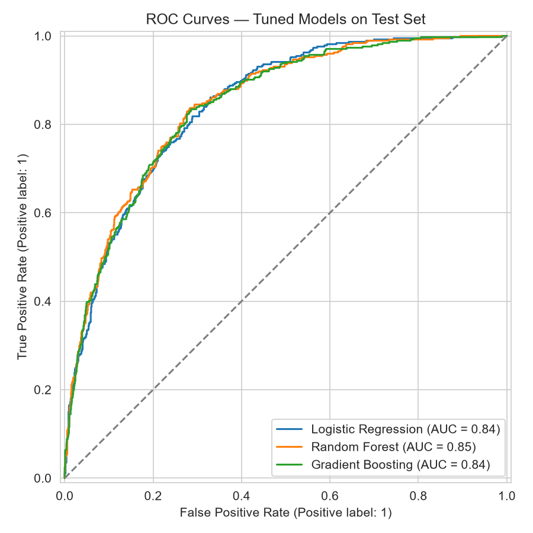
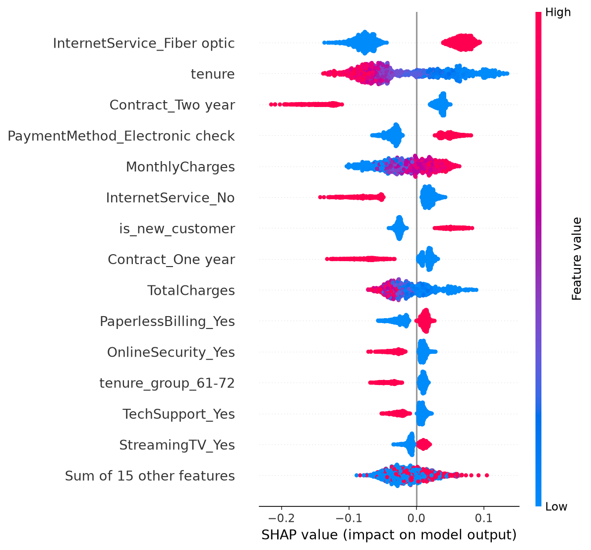

# Customer Attrition Prediction

End-to-end machine learning project predicting customer churn — data cleaning, EDA, model comparison, and explainability, with a deployed Streamlit app.

**Status:** Full pipeline complete — data cleaning, EDA, feature engineering, modeling, explainability, and a working Streamlit app (tested locally; see Deployment below to publish it live).

## Overview

This section will describe the business problem, dataset, modeling approach, and results once the project is built out.

## Dataset

**[Telco Customer Churn](https://www.kaggle.com/datasets/blastchar/telco-customer-churn)** (originally released by IBM as a sample dataset for customer retention analysis).

- 7,043 customers, 21 features (demographics, account info, services subscribed)
- Target: `Churn` (Yes/No) — 26.5% churn rate (realistic class imbalance)
- Business context: a telecom provider's customer-level data, used to predict which customers are likely to cancel their subscription

The raw CSV is not committed to this repo (data files shouldn't live in git history). To reproduce:

```bash
# Download into data/raw/
curl -o data/raw/Telco-Customer-Churn.csv https://raw.githubusercontent.com/IBM/telco-customer-churn-on-icp4d/master/data/Telco-Customer-Churn.csv
```

## Exploratory Data Analysis

Full analysis: [`notebooks/01_data_cleaning_and_eda.ipynb`](notebooks/01_data_cleaning_and_eda.ipynb) · Business writeup: [`reports/eda_summary.md`](reports/eda_summary.md)

Key finding — contract type is the strongest churn driver found so far:



Month-to-month customers churn at **42.7%**, vs. **11.3%** for one-year and **2.8%** for two-year contracts. See the full writeup for all findings (tenure, pricing, internet service, and payment method effects).

## Feature Engineering & Selection

Full analysis: [`notebooks/02_feature_engineering_and_selection.ipynb`](notebooks/02_feature_engineering_and_selection.ipynb)

Added tenure buckets, average monthly spend, and service-count features, then validated each against the target with mutual information before keeping it:



One engineered feature (`avg_monthly_spend`) was dropped after validation — despite reasonable individual signal, it was 99.6% correlated with the existing `MonthlyCharges` column and added no new information. Final feature set: **29 features**, reduced from 38 after removing structurally redundant one-hot encoded columns.

## Modeling

Full analysis: [`notebooks/03_modeling.ipynb`](notebooks/03_modeling.ipynb) · Business writeup: [`reports/model_results.md`](reports/model_results.md)

Three models (Logistic Regression, Random Forest, Gradient Boosting) were tuned via grid search and compared on a held-out test set:



| Model | Accuracy | Precision | Recall | F1 | ROC-AUC |
|---|---|---|---|---|---|
| **Random Forest (selected)** | 0.756 | 0.527 | 0.791 | 0.632 | **0.846** |
| Logistic Regression | 0.740 | 0.507 | 0.805 | 0.622 | 0.844 |
| Gradient Boosting | 0.749 | 0.517 | 0.799 | 0.628 | 0.842 |

All three models converge to within 0.4 points of ROC-AUC — model choice mattered far less than the feature engineering work above. The selected model catches **79% of actual churners**, prioritizing recall over precision since missing a churner (lost customer) is costlier than an unnecessary retention offer (false positive).

## Explainability

Full analysis: [`notebooks/04_explainability.ipynb`](notebooks/04_explainability.ipynb) · Business writeup: [`reports/explainability_summary.md`](reports/explainability_summary.md)

Used SHAP to explain the model both globally (which features matter overall) and locally (why a specific customer was flagged):



SHAP's ranking closely matches the mutual information ranking from feature selection — two independent methods agreeing on the same top drivers (internet service type, tenure, contract type, payment method) is strong evidence these effects are real. Individual predictions come with a waterfall breakdown (e.g., the highest-risk customer in the test set, flagged at 96.4% churn probability, explained by short tenure, fiber optic service, and a month-to-month contract) — turning a bare probability into something a retention team can actually act on.

## Deployment

The `app/streamlit_app.py` app lets a user enter a customer's account details and get a churn probability plus a SHAP-based breakdown of why — tested locally end-to-end, including in-browser.

**Run locally:**

```bash
streamlit run app/streamlit_app.py
```

**Deploy to Streamlit Community Cloud:**

1. Push this repo to GitHub (already done).
2. At [share.streamlit.io](https://share.streamlit.io), connect the GitHub account and select this repo.
3. Set the app file path to `app/streamlit_app.py` and deploy.

Note: `models/best_model.joblib` and `models/feature_columns.json` are committed to this repo, unlike the raw/processed data — Streamlit Cloud does a fresh `git clone` rather than re-running the training notebooks, so the trained model has to actually be present in the repo for the app to work.

## Tech Stack

- Python
- scikit-learn
- SHAP
- Streamlit

## Project Structure

```
customer-churn-prediction/
├── data/
│   ├── raw/          # Original, unmodified datasets (not committed)
│   └── processed/    # Cleaned/engineered data ready for modeling
├── notebooks/         # Exploratory analysis (EDA, prototyping)
├── src/                # Reusable, production-quality Python modules
├── models/            # best_model.joblib + feature_columns.json (committed, needed for deployment)
├── app/                # Streamlit application
├── tests/              # Unit tests
├── reports/
│   └── figures/       # Saved plots/visualizations for the README and reports
├── requirements.txt
└── README.md
```

## Getting Started

```bash
# Clone the repo
git clone https://github.com/nazni-sr/customer-churn-prediction.git
cd customer-churn-prediction

# Create and activate a virtual environment
python -m venv .venv
.venv\Scripts\activate        # Windows
# source .venv/bin/activate   # macOS/Linux

# Install dependencies
pip install -r requirements.txt
```

## License

See [LICENSE](LICENSE).
